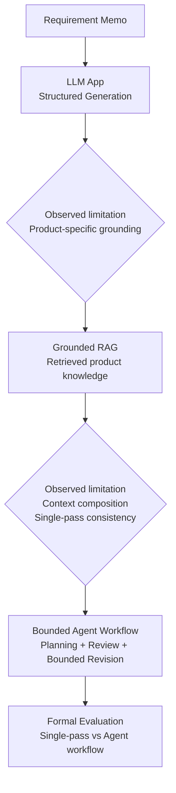
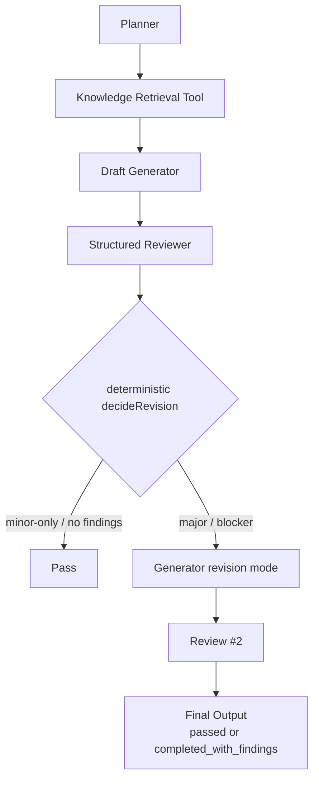

# AI Development Support Workbench

同一のdevelopment support problemを題材に、LLM App、Grounded RAG、Bounded AI Agent workflowへ段階的に発展させた個人技術検証リポジトリです。曖昧なrequirement memoを、実装可能な仕様、受け入れ条件、Jira task、実装計画、レビュー観点、リスクへ構造化し、その品質、retrieval、latency、token costを評価しています。

これはproduction RAG systemやcommercial AI platformではありません。実装・評価・失敗分析・設計修正を通じて、LLM application engineeringの意思決定を検証するPoCです。

## What This Project Explores

扱ったproblemは一貫しています。

```text
requirement memo
  -> GenerationOutput
```

`GenerationOutput`は以下のdevelopment artifactを含みます。

- `summary`
- `spec`
- `acceptanceCriteria`
- `jiraTasks`
- `implementationPlan`
- `reviewPoints`
- `risks`

最初はsingle LLM applicationとしてstructured generationを実装し、次にproduct-specific knowledge groundingのためRAGへ進み、最後にsingle-pass generationのartifact consistencyやambiguity controlを検証するためbounded Agent workflowへ進みました。

## Architecture Evolution



| Phase | 実装したarchitecture | 評価したこと | 次に進んだ理由 |
|---|---|---|---|
| LLM App | Next.js / React / TypeScript、provider abstraction、structured output、Zod validation | mock / OpenAI / Gemini / Anthropicを同一task・同一schema・同一評価軸で比較 | product-specific knowledge groundingが弱い |
| RAG | Qdrant local、OpenAI Embeddings、Markdown corpus、semantic retrieval、grounded generation | retrieval metrics、RAG OFF / ON、context diversity | Top-K context compositionとsingle-pass consistencyに課題が残る |
| AI Agent | Planner、Knowledge Retrieval Tool、Draft、Structured Reviewer、deterministic revision decision、bounded Revision | single-pass grounded generation vs bounded Agent workflow | quality gainとlatency/token costのtrade-offを判断する |

## Key Results

| Area | Main result | Interpretation |
|---|---|---|
| LLM App provider comparison | mock 3.4、Gemini 4.4、OpenAI 4.6、Claude 4.9 | 今回のプロフィール画像変更taskでは、provider/modelごとに出力傾向とlatencyが異なった。model selection is workload-specific。 |
| RAG context diversity | uniqueDocumentCount@5 `3 -> 5`、maximumChunksFromSameDocument `3 -> 1` | context diversityを改善し、common qualityは`4.7 -> 4.7`で概ね維持。 |
| RAG-specific quality | Source-grounded coverage `4.6 -> 4.8`、Retrieved source appropriateness `4.2 -> 4.8` | selected sourceの幅が広がり、storage/cache由来ruleの反映が増えた。 |
| Agent formal evaluation | common 5-axis `4.750 -> 4.725`、seven-axis `4.714 -> 4.768` | common qualityは概ね維持、seven-axisでは小幅改善。 |
| Agent consistency | Cross-field consistency `4.375 -> 5.000` | Agent workflowで最も明確に改善した軸。 |
| Agent trade-off | median elapsed約`1.78x`、mean total LLM tokens約`3.39x` | overheadはretrieval拡張ではなくmulti-step LLM orchestration側。 |

この結果は、現在のdataset、prompt、schema、provider/model、local environmentに限定したPoC観測です。provider企業全体、model一般、RAG一般、Agent一般の優劣として扱いません。

## LLM App PoC

LLM App PoCでは、requirement memoから`GenerationOutput`を生成する開発支援アプリを実装しました。

主な要素:

- Next.js / React / TypeScript
- `POST /api/generate`
- Zodによるrequest / output / history validation
- `LLM_PROVIDER=mock | openai | gemini | anthropic`
- OpenAI Responses API、Gemini GenerateContent、Claude Messages API
- `data/generations.json`へのlocal history保存
- provider / modelName / latency / token usage metadata
- Vitest
- Playwright

重要な設計判断は、providerごとのstructured output差分を吸収し、最終的に共通の`GenerationOutput` schemaで検証することです。同じ「プロフィール画像変更」入力を使い、同一schema・同一7評価軸でprovider比較を行いました。

| Provider / Model | Quality | Median client elapsed | Notes |
|---|---:|---:|---|
| `mock-local` | 3.4 / 5 | N/A | JSON shapeとUI/API flow確認 |
| Gemini 2.5 Flash | 4.4 / 5 | 12.2 s | 運用・リスク観点が広い |
| OpenAI `gpt-5.4-mini` | 4.6 / 5 | 7.0 s | 今回のtaskではquality / latency balanceが良い |
| Claude Haiku 4.5 | 4.9 / 5 | 11.3 s | 実装準備資料としての網羅性が高い |

詳細:

- [LLM App evaluation results](docs/llm_app_poc/evaluation_results.md)
- [LLM App latency evaluation](docs/llm_app_poc/latency_evaluation.md)
- [LLM App portfolio summary](docs/llm_app_poc/portfolio_summary.md)

## RAG PoC

RAG PoCでは、LLM Appのproduct-specific grounding不足に対して、synthetic product knowledge corpusをretrievalし、grounded `GenerationOutput`を生成する構成を実装しました。

主な要素:

- Qdrant OSS local
- OpenAI Embeddings
- `text-embedding-3-small`
- synthetic Markdown corpus: `data/rag/knowledge/`
- `fixed-size-v1`
- `heading-aware-v1`
- retrieval metadata
- RAG OFF / ON generation
- context selection policy

### Chunk Strategy Evaluation

| Strategy | Hit@5 | MRR | Source Recall@5 |
|---|---:|---:|---:|
| `fixed-size-v1` | 1.000 | 0.854 | 1.000 |
| `heading-aware-v1` | 1.000 | 1.000 | 1.000 |

`heading-aware-v1`はrankingを改善しましたが、chunk数とembedding量は増えます。Phase 1-C以降のgrounded generationでは、評価結果に基づき`heading-aware-v1`を使用しました。

### RAG OFF / ON

`openai` / `gpt-5.4-mini`、`llm-app-poc-rag-v1`、同一input、同一`GenerationOutput` schemaで比較しました。

- RAG OFF common 5-axis: 3.9 / 5
- RAG ON common 5-axis: 4.6 / 5

RAG ONでは、`POST /api/profile/image`、`multipart/form-data`、`image` field、latest profile image URL、validation messageなど、source-grounded product ruleの反映が増えました。

### Context Diversity Experiment

Phase 1-Dでは、RAG ONのTop 5に`profile-image-spec`が3slot入り、`frontend-cache-guideline`、`media-upload-security`、`storage-lifecycle`がcontext外になる問題を観測しました。

最初の仮説として`document-cap-v1`を試しました。

| Policy | maximumChunksFromSameDocument | uniqueDocumentCount@5 | Result |
|---|---:|---:|---|
| `raw-top-k-v1` | 3 | 3 | baseline |
| `document-cap-v1` | 2 | 3 | concentrationは下がったがdocument diversityは改善せず |

このnegative pilotから、`chunk concentration control != document diversity`と判断し、仮説を修正しました。

次に、candidate Top 10から各documentの最初のchunkを優先する`document-diversity-v1`を実装・評価しました。

| Metric | `raw-top-k-v1` | `document-diversity-v1` |
|---|---:|---:|
| uniqueDocumentCount@5 | 3 | 5 |
| maximumChunksFromSameDocument | 3 | 1 |
| Common 5-axis average | 4.7 | 4.7 |
| Source-grounded requirement coverage | 4.6 | 4.8 |
| Retrieved source appropriateness | 4.2 | 4.8 |

`document-diversity-v1`は今回のsynthetic corpus / query / Top-K条件で有効でしたが、universally optimalとは扱いません。`media-upload-security`はcandidate Top 10にも入らず、Candidate source absentとして残りました。

詳細:

- [RAG retrieval evaluation results](docs/rag_poc/retrieval_evaluation_results.md)
- [RAG grounded generation evaluation](docs/rag_poc/grounded_generation_evaluation_results.md)
- [RAG context diversity evaluation](docs/rag_poc/context_diversity_evaluation.md)
- [RAG portfolio summary](docs/rag_poc/portfolio_summary.md)

## AI Agent PoC

AI Agent PoCでは、単純なprompt chainをAgentと呼ばず、以下を持つbounded workflowとして実装しました。

- state
- decision
- tool use
- conditional transition
- bounded loop
- termination
- trace

Workflow:



設計上の制約:

- `maxRevisionCount = 1`
- Knowledge Retrieval Toolは1 Agent runにつき最大1回
- Revisionではknowledge resultをreuse
- Revisionは4th Agentではなく、Generatorのrevision mode
- single model / logical roles
- Reviewerはstructured findingsのみを返す
- `major` / `blocker`はrevision trigger
- `minor-only` / no findingsはpass
- technical / contract failureはfail closed

詳細:

- [AI Agent PoC spec](docs/agent_poc/agent_poc_spec_v0_1.md)
- [AI Agent Phase 1-B runtime foundation](docs/agent_poc/phase_1_b_runtime_foundation.md)
- [AI Agent Phase 1-D review / revision / trace / UI integration](docs/agent_poc/phase_1_d_review_revision_trace_ui_integration.md)

## AI Agent Formal Evaluation

Phase 1-Eでは、single-pass grounded generationとbounded Agent workflowを比較しました。

Evaluation design:

- 6 cases
- 16 runs
- Agent OFF: 8
- Agent ON: 8
- AGENT-001: 3 runs per mode
- blind manual scoring
- seven-axis rubric
- retrieval parity gate
- common `evaluationElapsedMs`

これはsystem-level workflow comparisonであり、strict single-variable causal ablationではありません。

| Metric | Agent OFF | Agent ON | Delta |
|---|---:|---:|---:|
| Common 5-axis average | 4.750 | 4.725 | -0.025 |
| Seven-axis average | 4.714 | 4.768 | +0.054 |
| Cross-field consistency | 4.375 | 5.000 | +0.625 |
| Unsupported assumption control | 4.750 | 4.875 | +0.125 |
| Jira decomposition appropriateness | 5.000 | 4.750 | -0.250 |
| Requirement-to-task traceability | 4.875 | 4.750 | -0.125 |

Paired result:

- Agent ON wins: 2
- Agent OFF wins: 1
- ties: 5

Retrieval parity:

- exact document parity: 1.000
- exact chunk parity: 1.000

retrieval evidence differenceとquality differenceは同時には観測されませんでした。ただし、これはAgent architecture alone caused the deltaのcausal proofではありません。

## Revision Analysis

Revisionは2件で発生しました。

| Case | Draft | Final | Delta | Interpretation |
|---|---:|---:|---:|---|
| AGENT-003 | 4.714 | 4.714 | 0.000 | Reviewer scope relevance inconsistencyとpossible major severity over-calibration。quality improvement caseではない。 |
| AGENT-006 | 4.571 | 5.000 | +0.429 | material cross-field inconsistencyをReviewerが検出し、Revision後にmanual quality improvementを観測。 |

Aggregate:

- mean draftToFinalQualityDelta: +0.214
- finalQualityRegressionRate: 0 / 2
- n = 2

重要なlearning:

- revision invoked != quality improved
- Reviewer finding != independent quality ground truth
- Revision effectivenessを一般化しない

詳細:

- [AI Agent Phase 1-E evaluation protocol](docs/agent_poc/phase_1_e_agent_workflow_evaluation.md)
- [AI Agent Phase 1-E evaluation results](docs/agent_poc/phase_1_e_agent_workflow_evaluation_results.md)

## Cost / Trade-Off

Agent workflowは品質の一部を改善しましたが、costは増えました。

| Metric | Agent OFF | Agent ON | Observation |
|---|---:|---:|---|
| median `evaluationElapsedMs` | 8549.5 ms | 15198.5 ms | about 1.78x |
| mean provider-reported total LLM tokens | 2344.0 | 7934.5 | about 3.39x |
| embedding usage mean | 94.5 | 94.5 | equal |

Agent overheadはretrieval expansionではなく、multi-step LLM orchestration側で観測されました。

Final recommendation:

Agent workflowをすべてのrequestのdefault pathにはしません。以下が重要なcaseでselective useするのが妥当です。

- artifact間consistency
- ambiguity control
- reviewable intermediate artifacts
- bounded correction
- complex / high-value workload

## Tech Stack

| Area | Stack |
|---|---|
| Frontend / Full-stack | Next.js, React, TypeScript |
| Validation | Zod |
| Testing | Vitest, Playwright |
| LLM providers | OpenAI, Gemini, Anthropic |
| RAG | Qdrant OSS, OpenAI Embeddings, `text-embedding-3-small` |
| Agent workflow | explicit TypeScript state machine, provider abstraction, structured output, deterministic workflow policy |

LangChain / LangGraphは使用していません。

## Repository Structure

```text
app/                         Next.js UI and API routes
lib/                         generation, schema, storage, provider code
lib/rag/                     RAG loader, chunker, embedding, Qdrant, retrieval, context selection
lib/agent/                   Agent state machine, orchestration, decision, evaluation support
data/rag/knowledge/          synthetic product knowledge corpus
docs/llm_app_poc/            LLM App design and evaluation docs
docs/rag_poc/                RAG design and evaluation docs
docs/agent_poc/              Agent design and evaluation docs
docs/portfolio/              technical achievement master
scripts/                     local diagnostics, RAG, and Agent evaluation commands
tests/                       Vitest test suites
```

Local runtime artifacts such as `data/generations.json`, `data/agent-runs.json`, and `data/agent/evaluation/*.json` are gitignored unless explicitly designed as public sample data.

## Detailed Documentation

- [Technical Achievement Master](docs/portfolio/ai_application_engineering_achievement_master.md)
- [LLM App evaluation results](docs/llm_app_poc/evaluation_results.md)
- [LLM App latency evaluation](docs/llm_app_poc/latency_evaluation.md)
- [RAG retrieval evaluation results](docs/rag_poc/retrieval_evaluation_results.md)
- [RAG grounded generation evaluation](docs/rag_poc/grounded_generation_evaluation_results.md)
- [RAG context diversity evaluation](docs/rag_poc/context_diversity_evaluation.md)
- [AI Agent PoC spec](docs/agent_poc/agent_poc_spec_v0_1.md)
- [AI Agent Phase 1-E evaluation results](docs/agent_poc/phase_1_e_agent_workflow_evaluation_results.md)

## Setup / Run

### Install And Start

```bash
npm install
npm run dev
```

Open `http://localhost:3000`.

### Environment Variables

Copy `.env.example` to `.env.local` and set only the values needed for your run.

```env
LLM_PROVIDER=mock

OPENAI_API_KEY=
OPENAI_MODEL=gpt-5.5

GEMINI_API_KEY=
GEMINI_MODEL=gemini-2.5-flash

ANTHROPIC_API_KEY=
ANTHROPIC_MODEL=claude-haiku-4-5-20251001

DEBUG_LLM_RESPONSE=0

RAG_EMBEDDING_PROVIDER=openai
OPENAI_EMBEDDING_MODEL=text-embedding-3-small
QDRANT_URL=http://localhost:6333
QDRANT_API_KEY=
RAG_CHUNK_STRATEGY=heading-aware-v1
RAG_TOP_K=5
```

`LLM_PROVIDER`:

- `mock`: API keyなしでZod schemaを通るmock outputを返す
- `openai`: `OPENAI_API_KEY`と`OPENAI_MODEL`を使用
- `gemini`: `GEMINI_API_KEY`と`GEMINI_MODEL`を使用
- `anthropic`: `ANTHROPIC_API_KEY`と`ANTHROPIC_MODEL`を使用

`.env.local`はgitignoredです。API key valuesをREADME、docs、logs、生成履歴、commitへ含めないでください。

### Provider Diagnostics

```bash
npm run check:openai-provider
npm run check:gemini
npm run check:gemini-provider
```

`DEBUG_LLM_RESPONSE=1`では、API keyやinput全文を含まないsafe metadataのみをserver consoleへ出します。

### RAG Local Setup

Start Qdrant:

```bash
docker compose up -d qdrant
docker compose ps
```

Ingest corpus:

```bash
npm run rag:ingest:fixed
npm run rag:ingest:heading
```

Evaluate retrieval:

```bash
npm run rag:evaluate:fixed
npm run rag:evaluate:heading
```

Qdrant dashboard:

```text
http://localhost:6333/dashboard
```

RAG ONでgrounded generationを確認する場合は、通常のローカルPowerShellでQdrantとdev serverを起動し、画面でRAGをONにします。sandboxed environmentからOpenAI Embeddings APIやQdrant実体への接続を成功したものとして扱わないでください。

### Agent Smoke And Evaluation

```bash
npm run agent:smoke
npm run agent:evaluate:run
npm run agent:evaluate:summarize
```

formal evaluationでは、manual blind scoringを挟みます。`agent:evaluate:run`が生成するruntime artifactsはlocal-onlyで、Git管理対象にしません。

### Tests

```bash
npm run typecheck
npm test
npm run test:e2e
npm run build
```

## Data And Security Policy

- `data/generations.json`: local generation history。gitignored。
- `data/agent-runs.json`: local Agent workflow history。gitignored。
- `data/agent/evaluation/phase_1_e_*.json`: local evaluation artifacts。gitignored。
- `data/sample-generations.json`: public-safe sample historyのみ。
- `data/rag/knowledge/`: synthetic product knowledge corpus。

Do not commit:

- API key values
- auth header values
- `.env.local`
- raw provider requests / responses
- hidden chain-of-thought
- embedding vectors
- private or customer data

## Scope / Limitations

- 個人技術検証であり、production RAG experienceやproduction AI Agent experienceを示すものではありません。
- RAG corpusはsynthetic 8-document corpusです。
- AI Agent formal evaluationは6 cases / 16 runsです。
- statistical significanceはclaimしません。
- 結果はcurrent dataset、prompt、schema、provider/model、local environmentに依存します。
- Agent OFF / ON比較はsystem-level workflow comparisonであり、strict single-variable causal ablationではありません。
- Reviewer precision limitation、scope relevance inconsistency、minor finding sensitivityを観測しています。
- Agent workflowはlatencyとLLM token costを増やします。
- `document-diversity-v1`は今回のtested workloadで有効だったpolicyであり、universally optimalではありません。

## Project Motivation

既存のsoftware engineering / technical leadershipで行ってきたrequirement clarification、task decomposition、implementation planning、review designを、LLM / RAG / bounded Agent workflowへ再構成して検証しました。READMEではtechnical repositoryとしての事実を中心に扱い、職務経歴や転職戦略の詳細は含めていません。
